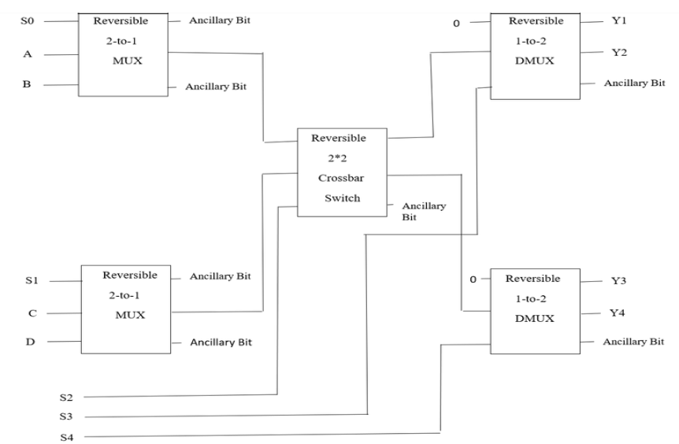
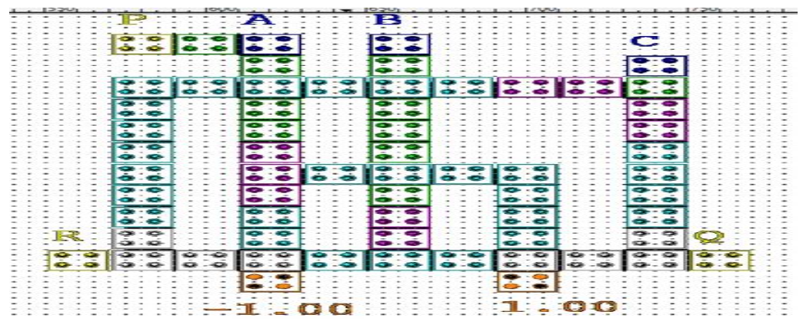
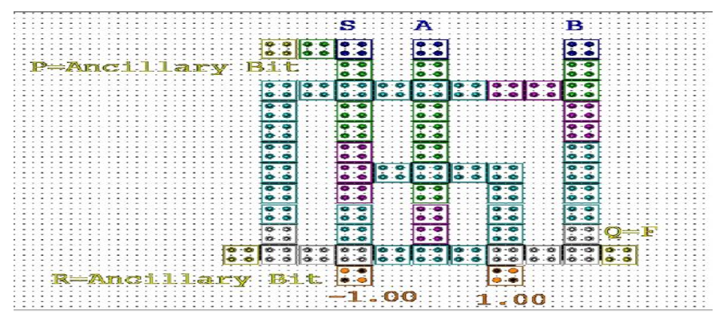
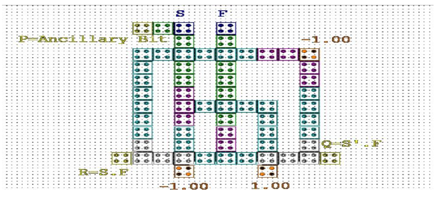
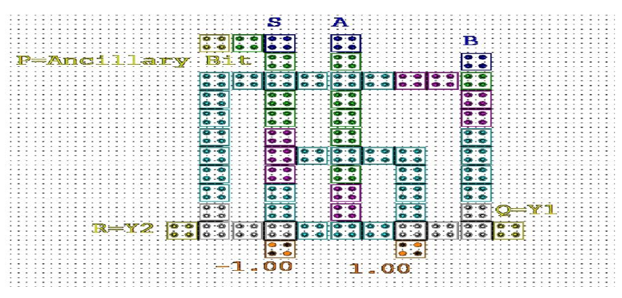
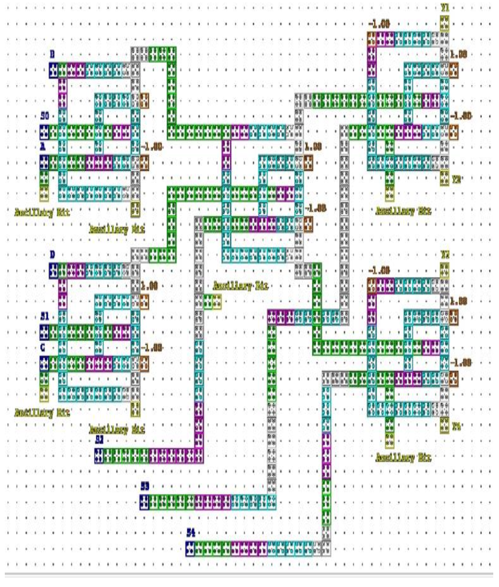
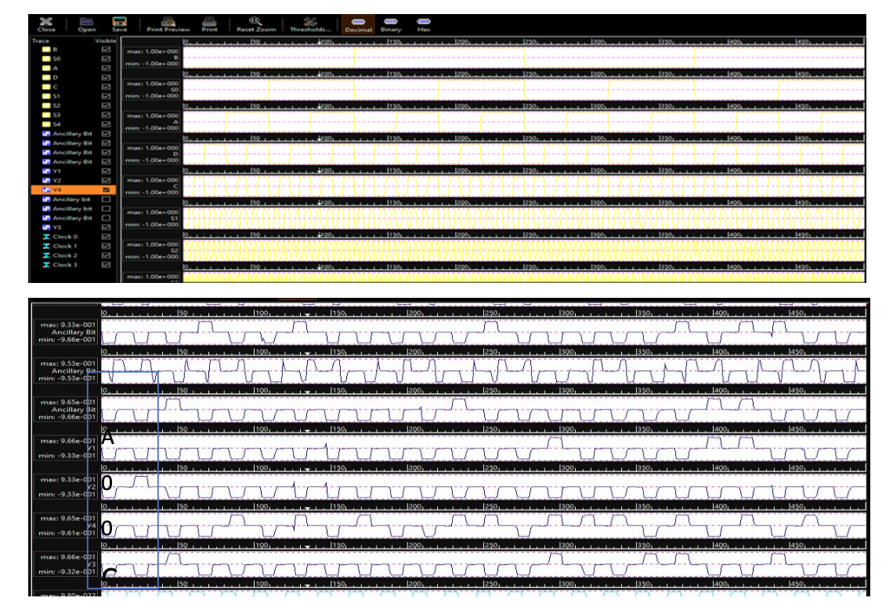
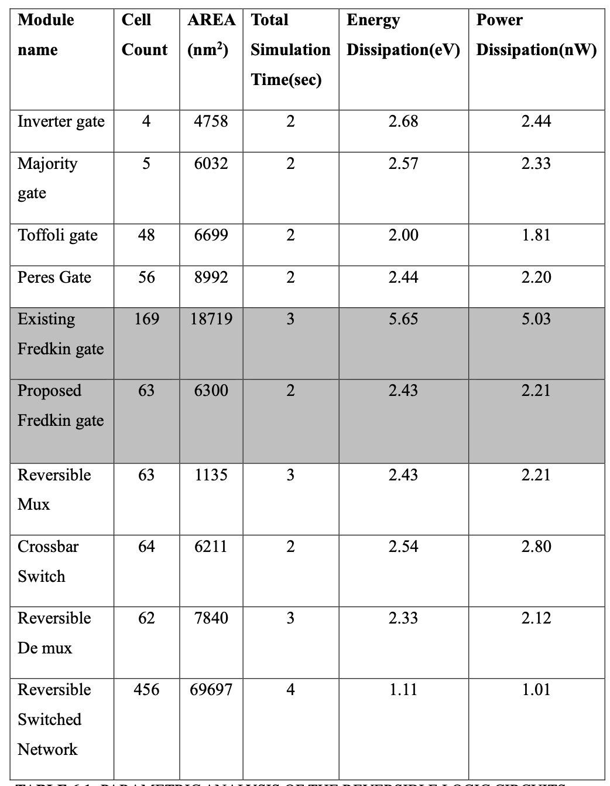

# Efficient Reversible Switched Network in QCA

This repository documents my bachelor's thesis project on designing an efficient reversible switched network using Quantum Dot Cellular Automata (QCA). I worked on this project as part of my Electronics and Communication Engineering degree, with a focus on reversible logic, low-power nano-computing, and QCA-based circuit design.

The main idea of the project was to design a reversible switching network using QCA logic blocks such as Fredkin, Toffoli, Peres, multiplexer, demultiplexer, and crossbar switch structures. The final design was simulated and compared using practical circuit-level metrics such as cell count, area, simulation time, energy dissipation, and power consumption.

## Why I Worked On This

Traditional CMOS-based circuits face scaling and power limitations as devices become smaller. QCA is an alternative nano-computing approach where information is represented using electron configuration instead of current flow. Reversible logic is also important because it can reduce information loss and energy dissipation in computational circuits.

This project helped me understand how circuit design, simulation, and performance comparison can be used to evaluate emerging computing technologies.

## Project Focus

- Designed reversible logic blocks for QCA-based switching
- Built a reversible switched network using transmitter, crossbar switch, and receiver blocks
- Simulated the circuit behaviour using QCA Designer tools
- Compared designs using cell count, area, simulation time, energy, and power
- Analysed how reversible logic can support low-power nano-scale circuit design

## Tools And Concepts

- QCA Designer
- QCA Designer-E
- Reversible logic circuits
- Quantum Dot Cellular Automata
- Fredkin, Toffoli, and Peres gates
- Multiplexer and demultiplexer design
- Crossbar switching network
- Circuit simulation and performance analysis

## System Design

The reversible switched network was built by combining smaller reversible logic modules. The design includes a transmitter section, crossbar switch, and receiver section.

## Important Circuit Blocks

### Proposed Fredkin Gate

The Fredkin gate was one of the important reversible logic components used in the project. The proposed design was evaluated using QCA layout and simulation parameters.

### Reversible Multiplexer

### Reversible Demultiplexer

### Crossbar Switch

## Final Reversible Switched Network

The final reversible switched network was designed and simulated in QCA. The layout below shows the complete QCA implementation of the proposed network.

The simulation result was used to verify the behaviour of the final network.

## Results

The final design was evaluated using area, number of cells, simulation time, energy dissipation, and power consumption. These metrics helped compare the efficiency of the proposed design against the individual reversible logic blocks.

From the final analysis, the reversible switched network achieved:

- Cell count: 456
- Area: 69697 nm²
- Simulation time: 4 seconds
- Energy dissipation: 1.11 eV
- Power consumption: 1.01 nW

## What I Learned

This project gave me practical exposure to a hardware-oriented research workflow: understanding the theory, designing logic blocks, simulating the design, checking outputs, and comparing performance metrics. It also helped me connect my electronics background with topics that are relevant to AI hardware, low-power computation, and emerging computing architectures.

## Project Type

Bachelor's thesis project, Electronics and Communication Engineering.
